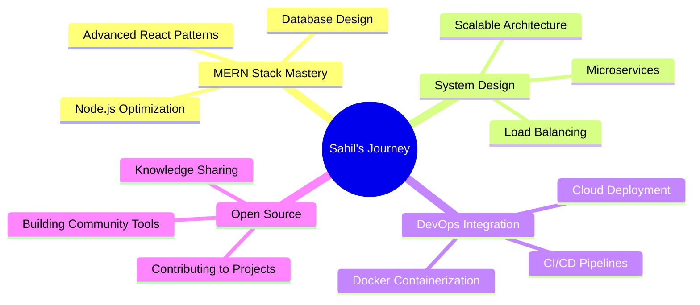

# 🌟 Sahil Gautam

<div align="center">


[](https://git.io/typing-svg)

> *"Code is like humor. When you have to explain it, it's bad."* – **Cory House**  
> *Building tomorrow's solutions with today's passion* 🚀

<div align="center">
  
  
  
</div>

---

### 🔗 Connect With Me

<div align="center">

[](https://portfolio-d8pm.onrender.com/)
[](mailto:sahilgautam0097@gmail.com)
[](https://www.linkedin.com/in/sahil-gautam-996155268/)
[](https://github.com/Unseencoderz)

[](https://www.geeksforgeeks.org/user/sahil213/)
[](https://www.hackerrank.com/profile/CS_2201640100255)

</div>

---

</div>

## 🎯 About Me

<div align="left">


```javascript
class Developer {
  constructor() {
    this.name = "Sahil Gautam";
    this.role = "Full-Stack Developer";
    this.education = "B.Tech CSE @ PSIT Kanpur";
    this.cgpa = "8.00/10.0";
    this.location = "Kanpur, India 🇮🇳";
    this.mindset = "Creative Problem Solver";
  }

  getSkills() {
    return {
      frontend: ["React", "Next.js", "Vue.js", "TypeScript"],
      backend: ["Node.js", "Express.js", "REST APIs"],
      databases: ["MongoDB", "PostgreSQL", "Firebase"],
      tools: ["Docker", "Git", "AWS", "Vercel"]
    };
  }

  getCurrentFocus() {
    return ["MERN Stack Mastery", "DevOps Integration", "System Design"];
  }
}

const sahil = new Developer();
console.log(sahil.getSkills());
```

</div>

---

## 🛠️ Tech Arsenal

<div align="center">

### Frontend Development
<p>

</p>

### Backend & Database
<p>

</p>

### DevOps & Tools
<p>

</p>

### Programming Languages
<p>

</p>

</div>

---

## 🎨 Featured Projects

<div align="center">

### 🔋 ChargeEase - EV Charging Platform
[](https://github.com/Unseencoderz/chargeease)

**🌟 Comprehensive EV charging station locator with real-time booking**
- 🔄 Real-time slot availability & booking system
- 💳 Integrated payment gateway
- 🗺️ Interactive maps with station locations
- 📱 Responsive design for all devices

[](https://chargease.netlify.app/)
[](https://github.com/Unseencoderz/chargeease)

**Tech Stack:** `MERN Stack` • `WebSockets` • `Tailwind CSS` • `Firebase`

---

### 🎮 Realtime Multiplayer Game
[](https://github.com/Unseencoderz/Gaming-website)

**🎯 4-in-a-row multiplayer game with real-time chat**
- ⚡ WebSocket real-time communication
- 💬 Integrated chat system
- 🏆 Multiplayer functionality
- 🎨 Interactive game interface

[](https://keen-hummingbird-2290d8.netlify.app/)
[](https://github.com/Unseencoderz/Gaming-website)

**Tech Stack:** `React` • `Node.js` • `Socket.io` • `MongoDB`

---

### 📺 DevStream - Project Showcase Platform
[](https://github.com/Unseencoderz/devstream)

**🌐 Collaborative platform for developers to showcase projects**
- 👥 Real-time chat & collaboration
- 🔐 Secure authentication system
- 📊 Project management features
- 💬 Community feedback system

[](https://devstream.lovable.app)
[](https://github.com/Unseencoderz/devstream)

**Tech Stack:** `MERN Stack` • `Socket.io` • `Firebase`

---

### 📚 Study Companion
[](https://github.com/Unseencoderz/Study-Companion)

**📖 Cross-platform study management application**
- 📅 Smart scheduling & reminders
- 📊 Progress tracking analytics
- 🔄 Multi-platform synchronization
- 🎯 Personalized study plans

[](https://cse-aktu-exam.netlify.app/)
[](https://github.com/Unseencoderz/Study-Companion)

**Tech Stack:** `React` • `MongoDB` • `Kotlin` • `Firebase`

</div>

---

## 🏆 Achievements & Certifications

<div align="center">

<table>
<tr>
<td align="center" width="50%">

### 🎯 Competitive Programming


</td>
<td align="center" width="50%">

### 🎓 Certifications


</td>
</tr>
</table>

[](https://drive.google.com/drive/folders/1PzStdtNELv0R1U6QGfkdkAwWIUZUVBMU)

</div>

---

## 📊 GitHub Analytics

<div align="center">


</div>

---

## 🐍 Contribution Snake

<div align="center">
  <picture>
    <source media="(prefers-color-scheme: dark)" srcset="https://raw.githubusercontent.com/Unseencoderz/Unseencoderz/output/github-contribution-grid-snake-dark.svg">
    <source media="(prefers-color-scheme: light)" srcset="https://raw.githubusercontent.com/Unseencoderz/Unseencoderz/output/github-contribution-grid-snake.svg">
    
  </picture>
</div>

---

## 💭 Daily Motivation

<div align="center">

[](https://github.com/piyushsuthar/github-readme-quotes)

### 🎯 Current Goals



</div>

---

<div align="center">

### 💬 Let's Build Something Amazing Together!

**"The best time to plant a tree was 20 years ago. The second best time is now."**  
*Ready to turn ideas into reality* 🌱➡️🌳

---


**⭐ Don't forget to star repositories you find interesting!**

[](https://github.com/Unseencoderz)

</div>
